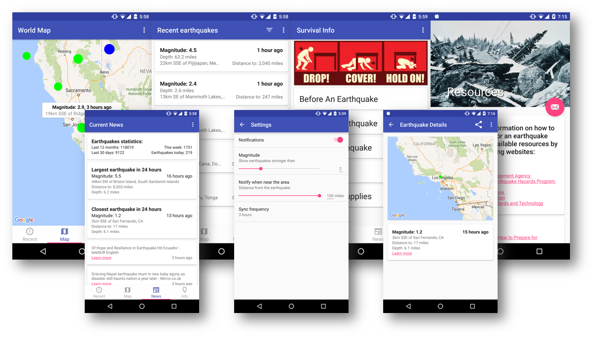

# Earthquake Survival
Earthquake Survival allows you to see all the earthquakes around the world and notifies about closest to you (you can set the notifying threshold for strength and distance from you). You can find the latest news about earthquakes, share info and statistics with your friends. Earthquake Survival also has a lot of useful information about what to do in case of emergency, who to call, what to buy and how to survive.

## Current state

## Project Schema
* [Detailed overview of the proposed application](materials/Capstone_Stage1.pdf)

## Required Components
* [Third Party Libraries](https://github.com/dmytroKarataiev/EarthquakeSurvival/blob/34f24be78184e83985284d44d99b91444b41257d/app/build.gradle#L62)
* [Widget with meaningful information](app/src/main/java/com/adkdevelopment/earthquakesurvival/widget)
* Google Services:
  * [Locations](https://github.com/dmytroKarataiev/EarthquakeSurvival/blob/34f24be78184e83985284d44d99b91444b41257d/app/src/main/java/com/adkdevelopment/earthquakesurvival/PagerActivity.java#L117)
  * [Maps](app/src/main/java/com/adkdevelopment/earthquakesurvival/MapviewFragment.java)
* [Gradle with signing configuration](app/build.gradle)
* [ContentProvider](https://github.com/dmytroKarataiev/EarthquakeSurvival/blob/34f24be78184e83985284d44d99b91444b41257d/app/src/main/java/com/adkdevelopment/earthquakesurvival/provider/EarthquakeProvider.java)
* [SyncAdapter](https://github.com/dmytroKarataiev/EarthquakeSurvival/blob/34f24be78184e83985284d44d99b91444b41257d/app/src/main/java/com/adkdevelopment/earthquakesurvival/syncadapter/SyncAdapter.java#L63)
* [Loader to move data to views](https://github.com/dmytroKarataiev/EarthquakeSurvival/blob/34f24be78184e83985284d44d99b91444b41257d/app/src/main/java/com/adkdevelopment/earthquakesurvival/RecentFragment.java#L88)
* [SharedTransitions](app/src/main/java/com/adkdevelopment/earthquakesurvival/RecentAdapter.java)
* [Notifications](https://github.com/dmytroKarataiev/EarthquakeSurvival/blob/b7d081d0fafe7db03648ba55b8dd22326ddfca5a/app/src/main/java/com/adkdevelopment/earthquakesurvival/geofence/GeofenceService.java#L97)
* [ShareActionProvider](app/src/main/java/com/adkdevelopment/earthquakesurvival/DetailFragment.java)
* [Broadcast Events](https://github.com/dmytroKarataiev/EarthquakeSurvival/blob/d70d8f53387c5aac9ad0d7df337542722549e9d9/app/src/main/AndroidManifest.xml#L120)
* [Parallax Scroll](app/src/main/java/com/adkdevelopment/earthquakesurvival/SurvivalFragment.java)
* Accessibility features: content descriptions, RTL, correct navigation (whole app).

## Future development
* Design improvements
* Collection widget
* Add more information to earthquakes
* Sort by magnitude, time, distance
* Add more earthquakes (up to 7 days info)

## Important information
* For the app to work you need to add Google Maps Api key to the apikeys.xml file in values folder  
String should look like this: \<string name="google.maps.api.key.release">YOUR API KEY\</string>

## Used materials
* Safety picture: http://emergency.cdc.gov/disasters/earthquakes/during.asp
* Earthquake photo 1: http://themilitaryengineer.com/tme_online/2014_mar_apr/alaska/C_BuildingCollapse.jpg
* Earthquake photo 2: http://sameblog.org/wp-content/uploads/2014/03/C_AKCOEComplex.jpg
* Earthquake photo 3: https://upload.wikimedia.org/wikipedia/commons/a/ae/Good_Friday_Earthquake_at_Turnagain_Arm.jpg
* Survival information: https://www.ready.gov/earthquakes
* Emergency Supplies: http://emergency.cdc.gov/disasters/earthquakes/supplies.asp

License
-------

	The MIT License (MIT)

	Copyright (c) 2016 Dmytro Karataiev

	Permission is hereby granted, free of charge, to any person obtaining a copy
	of this software and associated documentation files (the "Software"), to deal
	in the Software without restriction, including without limitation the rights
	to use, copy, modify, merge, publish, distribute, sublicense, and/or sell
	copies of the Software, and to permit persons to whom the Software is
	furnished to do so, subject to the following conditions:

	The above copyright notice and this permission notice shall be included in all
	copies or substantial portions of the Software.

	THE SOFTWARE IS PROVIDED "AS IS", WITHOUT WARRANTY OF ANY KIND, EXPRESS OR
	IMPLIED, INCLUDING BUT NOT LIMITED TO THE WARRANTIES OF MERCHANTABILITY,
	FITNESS FOR A PARTICULAR PURPOSE AND NONINFRINGEMENT. IN NO EVENT SHALL THE
	AUTHORS OR COPYRIGHT HOLDERS BE LIABLE FOR ANY CLAIM, DAMAGES OR OTHER
	LIABILITY, WHETHER IN AN ACTION OF CONTRACT, TORT OR OTHERWISE, ARISING FROM,
	OUT OF OR IN CONNECTION WITH THE SOFTWARE OR THE USE OR OTHER DEALINGS IN THE
	SOFTWARE.